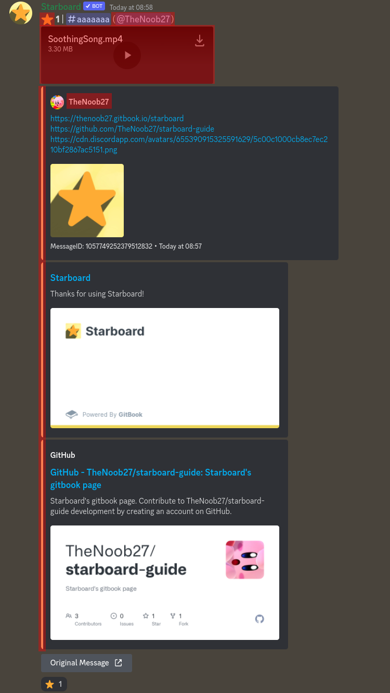

# Customising The Starboard Message

Above is an example of what a starboard message can look like. Everything highlighted in **red** can be customised in some way. Here's what they are and how to change them.

## Requirements

First, we have to tell you about the Requirements setting. This determines when the second, third and fourth star and colour show up. By default, the requirements are as following:

* First: 10 stars
* Second: 20 stars
* Third: 30 stars

The first requirement determines when the second star and colour shows up, the second requirement determines the third star/colour and so on.

You can change them with `star changesetting requirements <first/second/third> <[number]>`

## Star

The ⭐️ beside the number of stars changes depending on how many stars the message has. You can also change the emoji that shows up there. 

There are 4 emojis that show up depending on the amount of stars the message has, we call them First, Second, Third and Fourth.

You can change the star with `star changesetting stars <first/second/third/fourth> <[emoji]>`

## Embed Colour

The embed colour changes along with the star beside the counter.


The bot looks for the highest changed colour to use. This means if you only changed the first colour, only that one will be used. If you only changed the first and second colour, the first will be used until the first requirement is reached, then the second will be used from then on.


If you want to set the colour for all amounts of stars, do `star changesetting colour <[colour]>` \(shortcut for first\), or else do `star changesetting colours <first/second/third/fourth> <[colour]>`


When changing the colour, you can input something along the lines of `#abc`, `#abcdef`, `0xabc`, `0xabcdef`, `rgb(0, 0, 0)` or `[0, 0, 0]` \(rgb\).


## Mention The Author

You have the option for each starboard message to ping the author of the starred message. This is disabled by default.

To enable this, do `star changesetting mentionauthor yes`

## Show The Nickname

If you want the nickname of the author to be shown instead of their Discord tag, do `star changesetting displayNickname yes`


In the above image, the setting is already enabled.


## Attach Files

You have the option for the bot to send all media as attachments instead of simply links that lead to the attachments. You can do this by enabling the **Attachments** setting: `star changesetting attachments yes`


And that's it! These are all the possible ways of customising the embed. There could be more to come soon!


